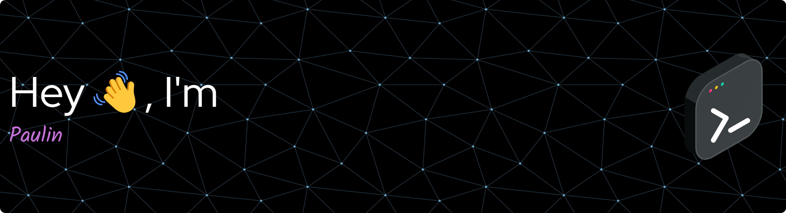

## 📈 GitHub Stats
<!--

  
 

-->
<table align="center">
    <tr style="border: none;">
        <td align="center" width="50%" style="border: none;">
            
        </td>
        <td align="center" width="50%" style="border: none;">
            
        </td>
    </tr>
</table>

## 🔧 Technologies & Tools

  
  

  
  

## 🏆 GitHub Stat Trophies

<!--
- 🔭 I’m currently working on ...
- 🌱 I’m currently learning ...
- 👯 I’m looking to collaborate on ...
- 🤔 I’m looking for help with ...
- 💬 Ask me about ...
- 📫 How to reach me: ...
- 😄 Pronouns: ...
- ⚡ Fun fact: ...
-->
